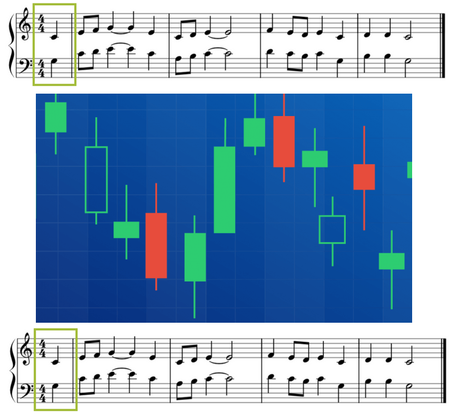

Has it happened to you when a song was really *speaking* to you? Do you like some of your favorite songs for their lyrics? When you think of a particular music genre (e.g., classic rock), do you expect certain *topics* or *sentiments* for the lyrics? 

The goal of this project is to look deeper into the patterns and characteristics of different types of song lyrics. Applying tools from natural language processing and text mining, students should derive interesting findings in this collection of song lyrics and write a "data story" that can be shared with a general audience. 
 

<h3>Title: Does Finance Imitate Art?</h3> 

This project finds if there is a connection between the worlds of finance and art.
 

Post Markdown<a href="https://htmlpreview.github.io/?https://github.com/dps2150/DS-Blog/blob/main/Does%20Finance%20Imitate%20Art/doc/Project1_dps2150.html">View Post</a>  

